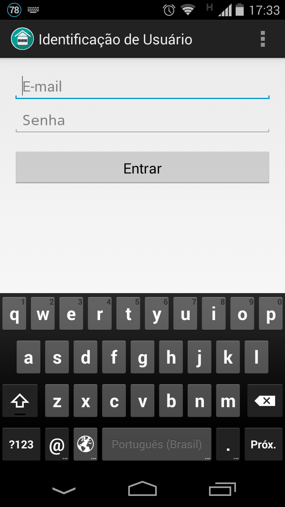
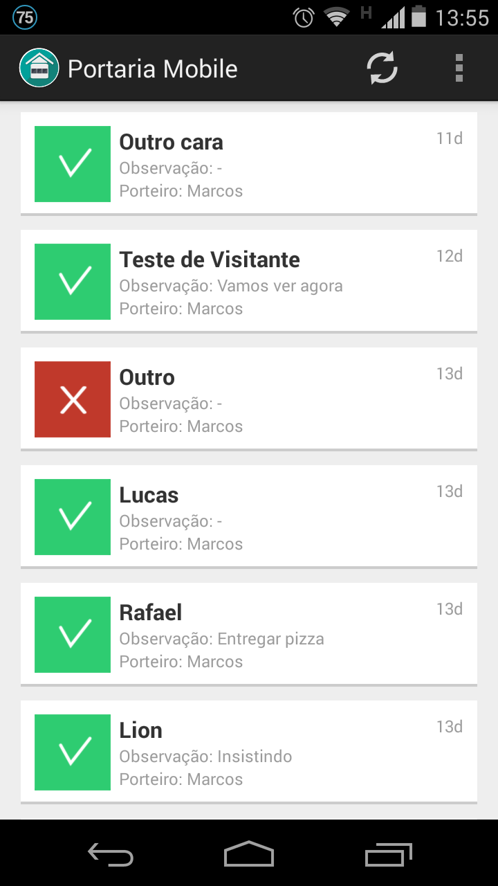
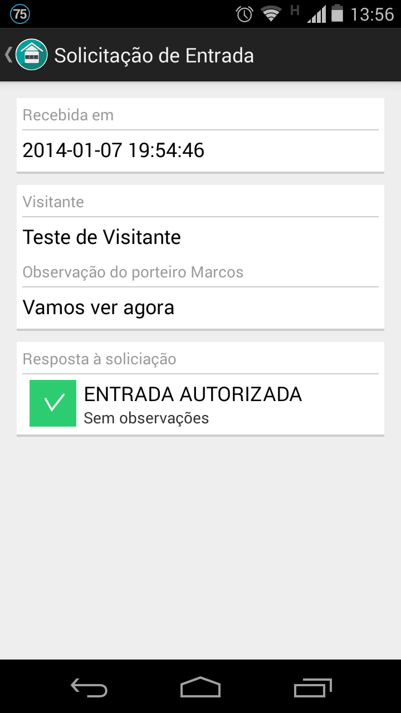
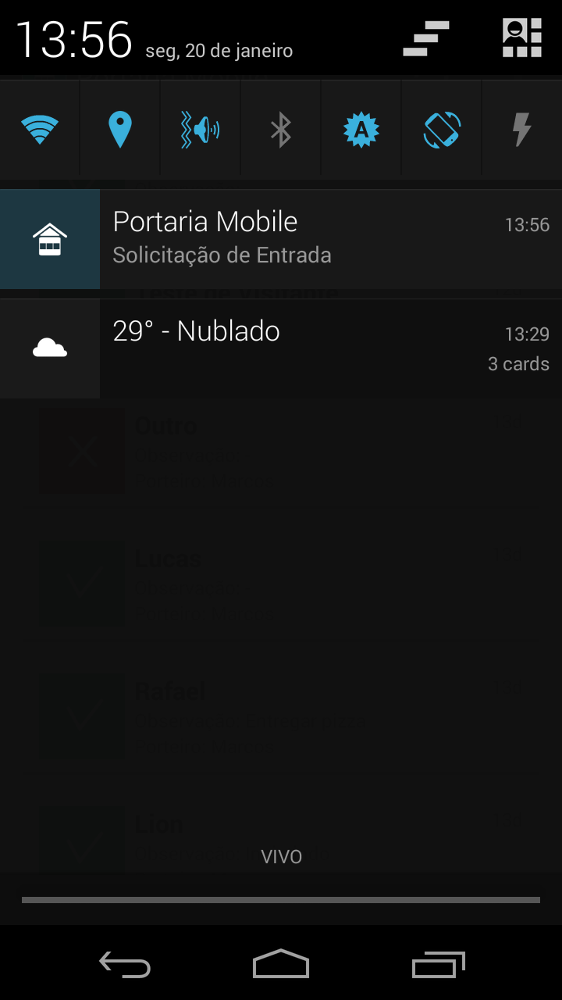
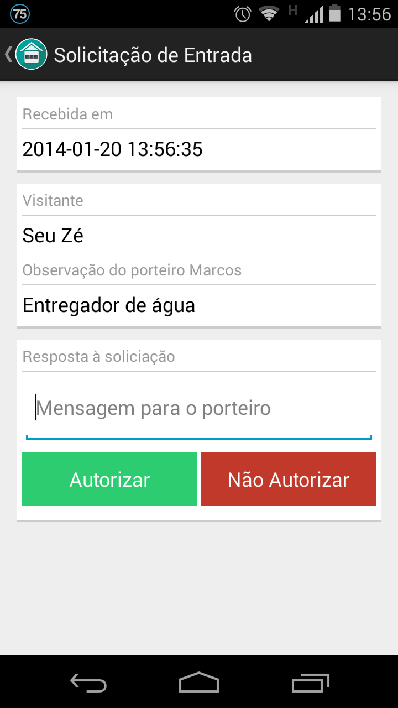
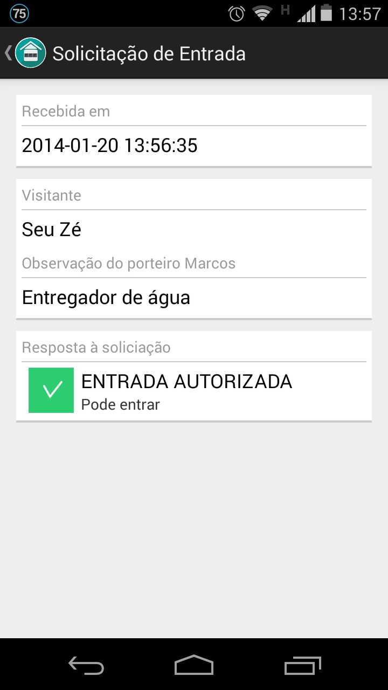
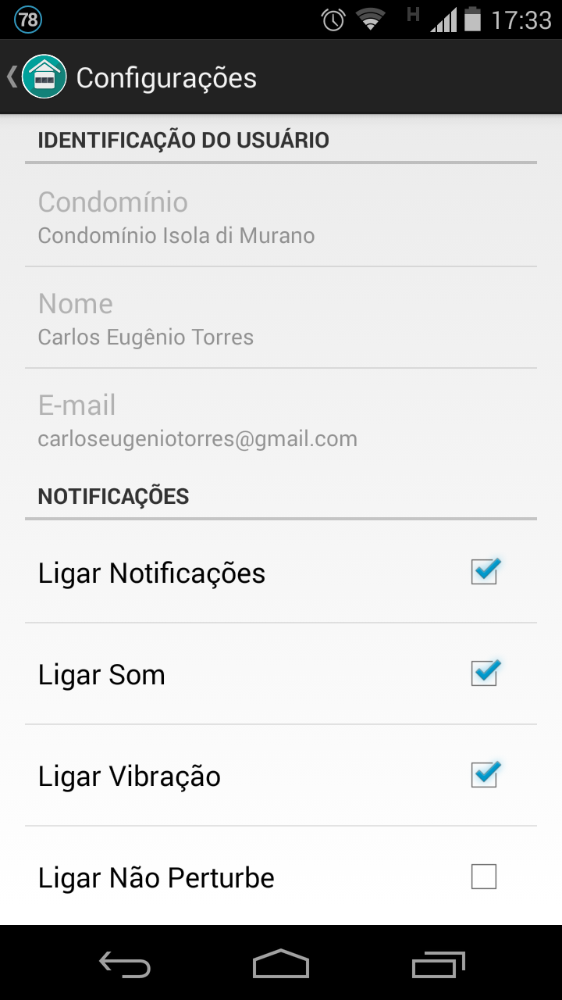

Portaria Mobile (mobile entrance)
=================================

Android client for my service Portaria Mobile (mobile entrance). A building entrance security control service.
With Portaria Mobile it's possible to control and authorize people entrance in a building or condo through the smartphone.

Administration panel: http://cacira.com/portariamobile

Google Play Store link: https://play.google.com/store/apps/details?id=br.com.cacira.portariamobile

More information: carlos.torres@cacira.com

== Screenshots ==

